# RTX Cinema - All Subsystem Diagrams

## 1. User Authentication & Authorization System (UAAS)

### 1.1 Activity Diagram - UAAS
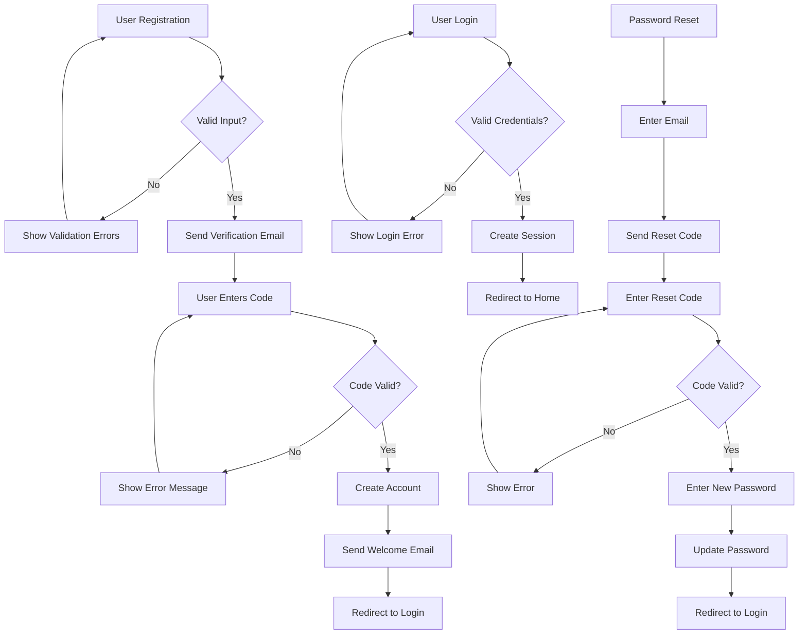

### 1.2 Use Case Diagram - UAAS
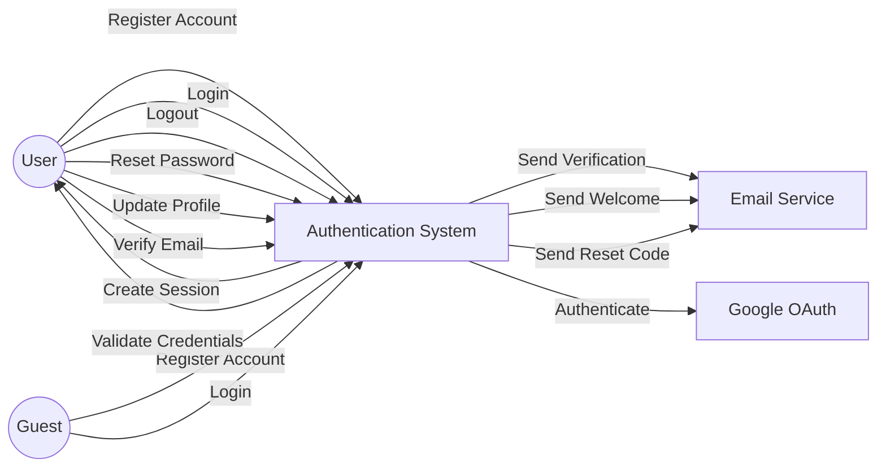

### 1.3 Sequence Diagram - UAAS
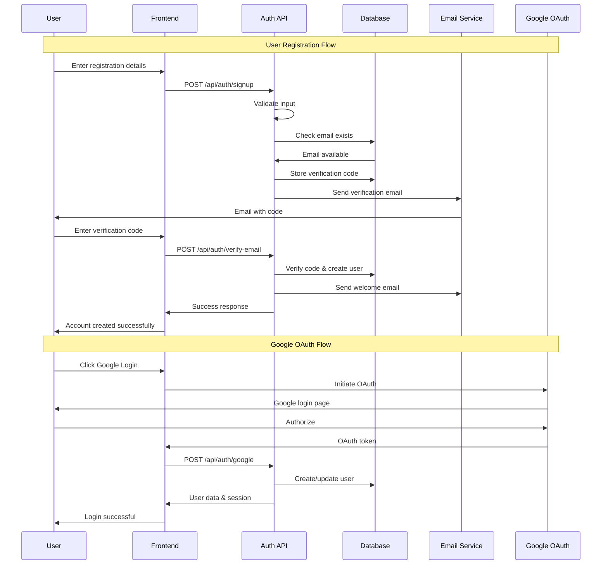

### 1.4 Class Diagram - UAAS
```mermaid
classDiagram
    class User {
        +String id
        +String login
        +String email
        +String password
        +String name
        +String googleId
        +String authMethod
        +Date createdAt
        +Date updatedAt
        +register()
        +login()
        +logout()
        +resetPassword()
        +updateProfile()
        +verifyEmail()
        +validatePassword()
    }
    
    class EmailVerification {
        +String id
        +String email
        +String code
        +Object userData
        +String verificationType
        +Date createdAt
        +Date expiresAt
        +generateCode()
        +validateCode()
        +isExpired()
        +cleanup()
    }
    
    class PasswordReset {
        +String id
        +String email
        +String code
        +Date createdAt
        +Date expiresAt
        +generateResetCode()
        +validateResetCode()
        +isExpired()
        +cleanup()
    }
    
    class AuthController {
        +signup()
        +verifyEmail()
        +login()
        +logout()
        +resetPassword()
        +googleAuth()
        +updateProfile()
    }
    
    class SessionManager {
        +String sessionId
        +String userId
        +Date expiresAt
        +createSession()
        +validateSession()
        +destroySession()
        +refreshSession()
    }
    
    User ||--o{ EmailVerification : verifies
    User ||--o{ PasswordReset : requests
    User ||--o{ SessionManager : has
    AuthController --> User : manages
    AuthController --> EmailVerification : creates
    AuthController --> PasswordReset : creates
```

## 2. Email Communication & Notification System (ECNS)

### 2.1 Activity Diagram - ECNS
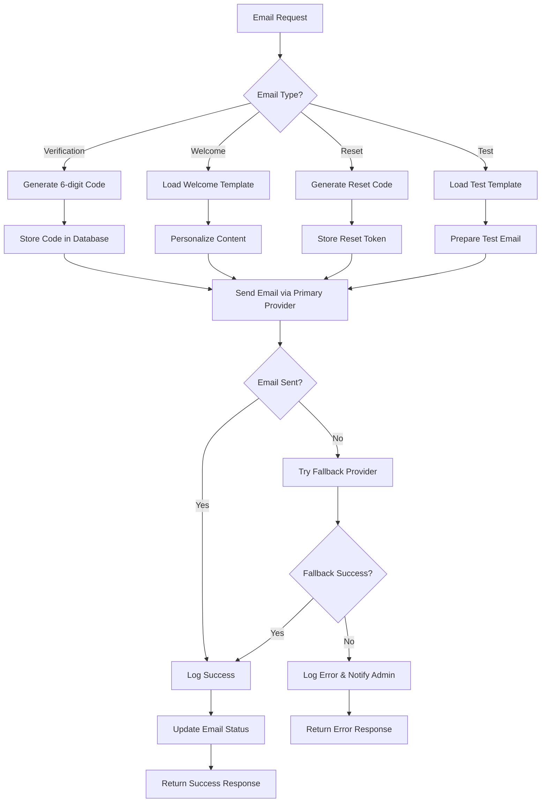

### 2.2 Use Case Diagram - ECNS
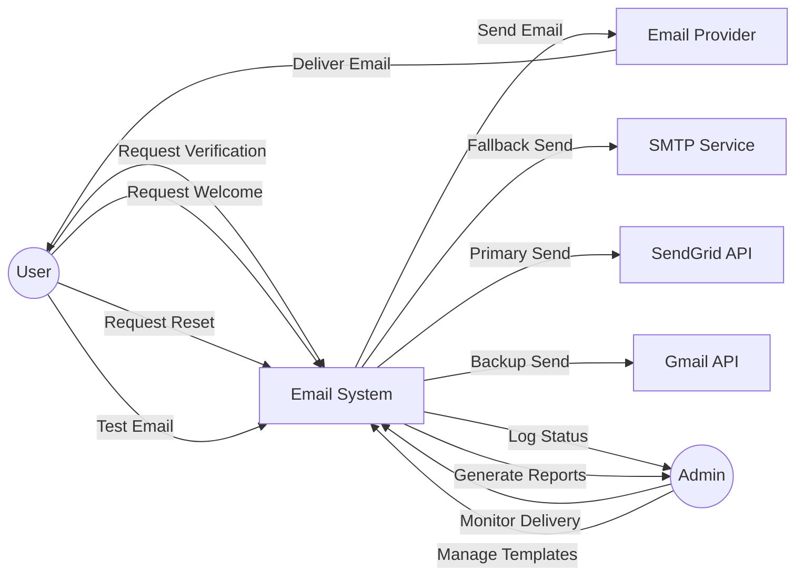

### 2.3 Sequence Diagram - ECNS
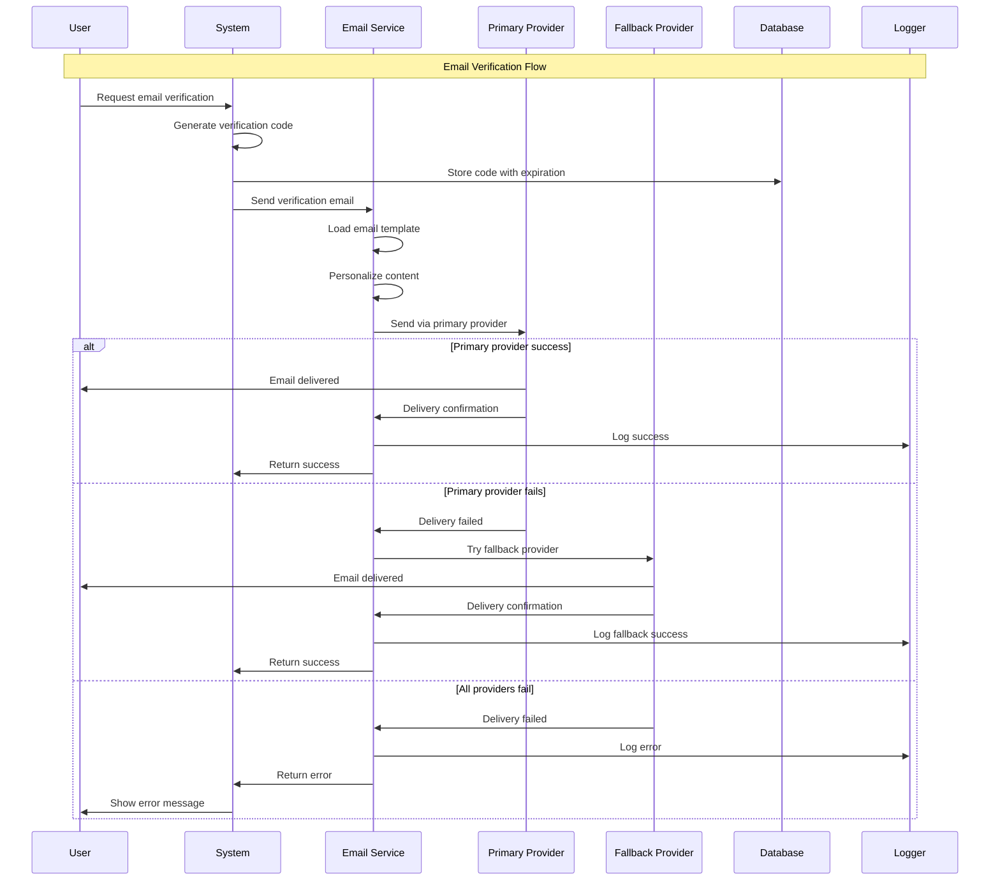

### 2.4 Class Diagram - ECNS
```mermaid
classDiagram
    class EmailService {
        +String primaryProvider
        +String fallbackProvider
        +Object config
        +sendVerificationEmail()
        +sendWelcomeEmail()
        +sendResetEmail()
        +sendTestEmail()
        +generateCode()
        +validateProvider()
        +switchProvider()
    }
    
    class EmailTemplate {
        +String id
        +String type
        +String subject
        +String htmlContent
        +String textContent
        +Object variables
        +render()
        +personalize()
        +validate()
        +preview()
    }
    
    class EmailProvider {
        +String name
        +String apiKey
        +String endpoint
        +Object config
        +send()
        +validateConfig()
        +testConnection()
        +getStatus()
    }
    
    class EmailLog {
        +String id
        +String recipient
        +String type
        +String status
        +String provider
        +Date sentAt
        +String errorMessage
        +logDelivery()
        +trackStatus()
        +generateReport()
    }
    
    class EmailQueue {
        +String id
        +String recipient
        +String type
        +Object data
        +Number priority
        +Number retryCount
        +Date scheduledAt
        +enqueue()
        +dequeue()
        +retry()
        +process()
    }
    
    EmailService ||--o{ EmailTemplate : uses
    EmailService ||--o{ EmailProvider : manages
    EmailService ||--o{ EmailLog : creates
    EmailService ||--o{ EmailQueue : processes
    EmailProvider ||--o{ EmailLog : generates
```

## 3. Movie Catalog & Content Management System (MCCMS)

### 3.1 Activity Diagram - MCCMS
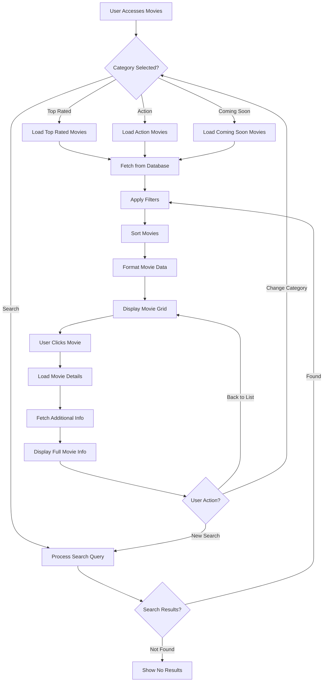

### 3.2 Use Case Diagram - MCCMS
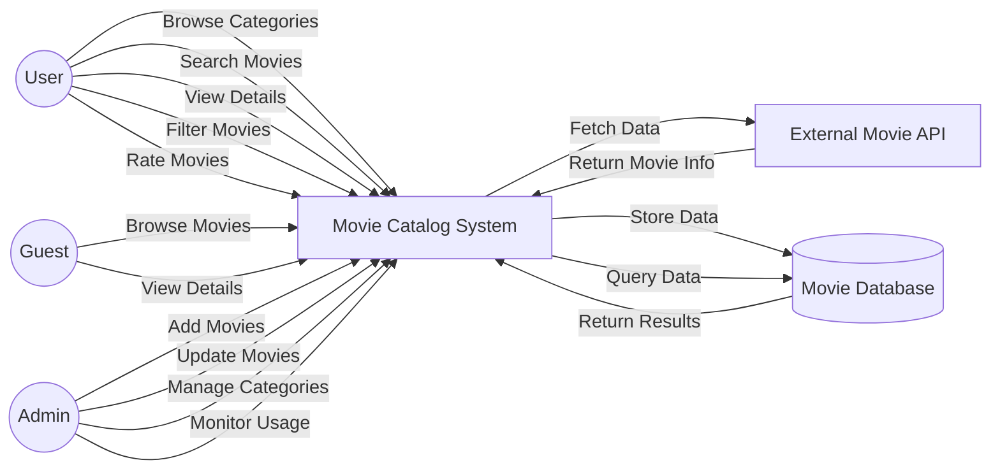

### 3.3 Sequence Diagram - MCCMS
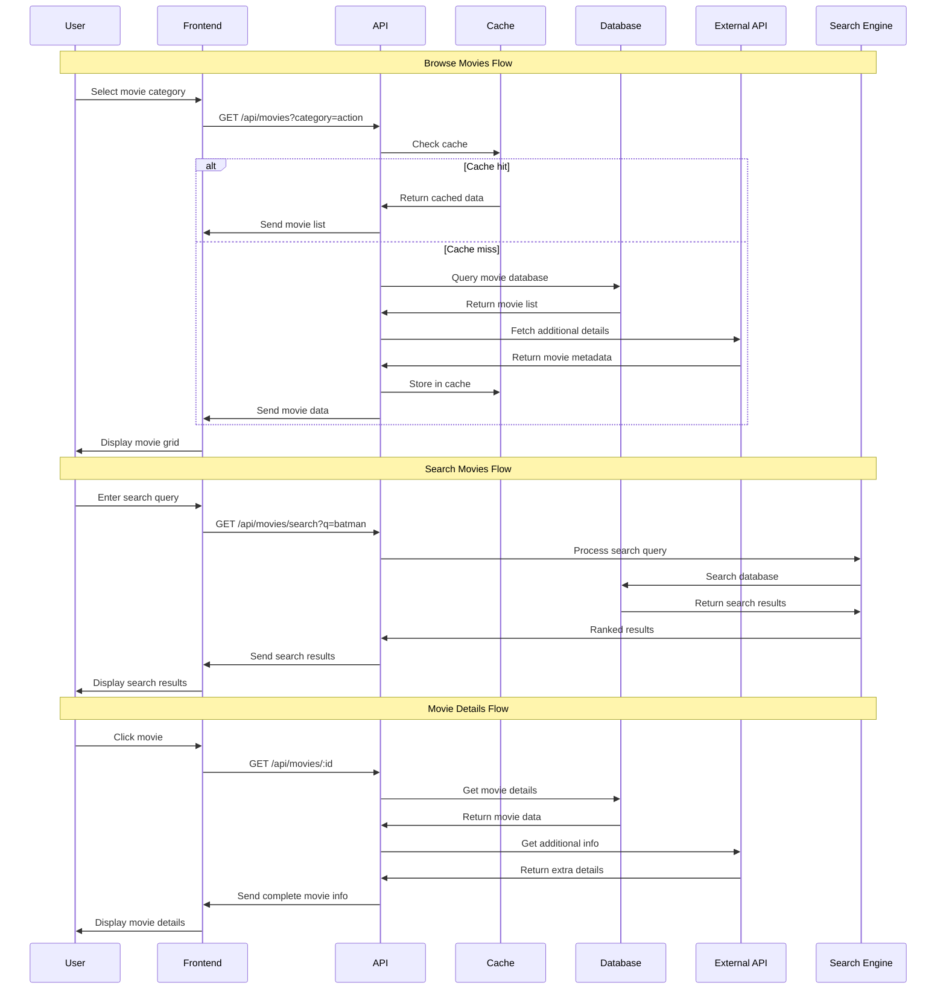

### 3.4 Class Diagram - MCCMS
```mermaid
classDiagram
    class Movie {
        +String id
        +String title
        +Number rating
        +String genre
        +String year
        +String image
        +String synopsis
        +Array cast
        +String category
        +Date releaseDate
        +String director
        +Number duration
        +getDetails()
        +updateRating()
        +addReview()
        +updateInfo()
    }
    
    class Category {
        +String id
        +String name
        +String description
        +Array movies
        +String sortOrder
        +addMovie()
        +removeMovie()
        +getMovies()
        +updateCategory()
    }
    
    class Review {
        +String id
        +String movieId
        +String userId
        +Number rating
        +String comment
        +Date createdAt
        +Boolean approved
        +validate()
        +moderate()
        +approve()
    }
    
    class SearchEngine {
        +String indexName
        +Object config
        +search()
        +indexMovie()
        +updateIndex()
        +deleteFromIndex()
        +buildQuery()
        +rankResults()
    }
    
    class MovieController {
        +getMovies()
        +getMovieById()
        +searchMovies()
        +getCategories()
        +addMovie()
        +updateMovie()
        +deleteMovie()
    }
    
    class CacheManager {
        +String cacheKey
        +Number ttl
        +get()
        +set()
        +delete()
        +clear()
        +exists()
    }
    
    Movie ||--o{ Review : has
    Category ||--o{ Movie : contains
    MovieController --> Movie : manages
    MovieController --> Category : manages
    MovieController --> SearchEngine : uses
    MovieController --> CacheManager : uses
    SearchEngine --> Movie : indexes
```

## 4. User Interface & Experience System (UIES)

### 4.1 Activity Diagram - UIES
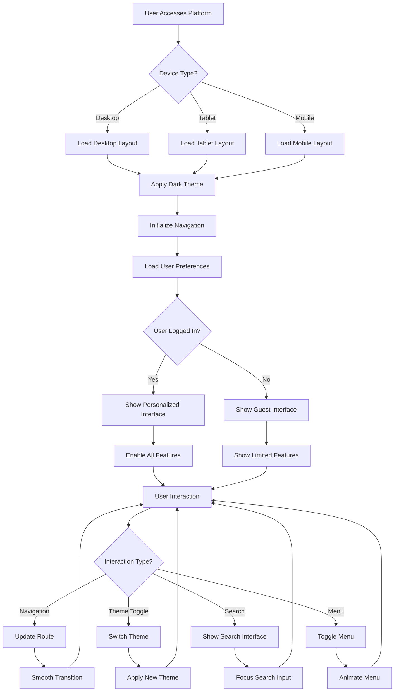

### 4.2 Use Case Diagram - UIES
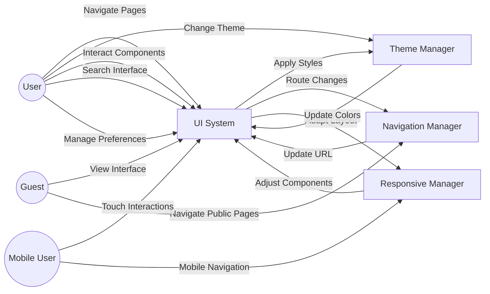

### 4.3 Sequence Diagram - UIES
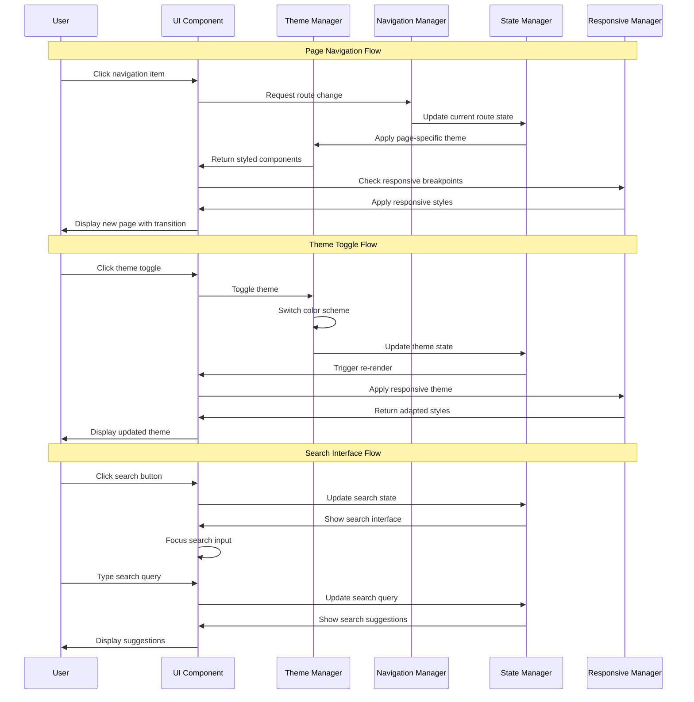

### 4.4 Class Diagram - UIES
```mermaid
classDiagram
    class UIComponent {
        +String id
        +Object props
        +Object state
        +String theme
        +Boolean responsive
        +render()
        +handleEvents()
        +updateState()
        +applyStyles()
    }
    
    class ThemeManager {
        +Object darkTheme
        +Object lightTheme
        +String currentTheme
        +Object customColors
        +applyTheme()
        +toggleTheme()
        +getColors()
        +setCustomTheme()
        +validateTheme()
    }
    
    class NavigationManager {
        +Array routes
        +String currentRoute
        +Object history
        +Object breadcrumbs
        +navigate()
        +goBack()
        +goForward()
        +updateRoute()
        +generateBreadcrumbs()
    }
    
    class ResponsiveManager {
        +Object breakpoints
        +String currentBreakpoint
        +Object deviceInfo
        +checkBreakpoint()
        +adaptLayout()
        +getDeviceType()
        +updateBreakpoint()
    }
    
    class StateManager {
        +Object globalState
        +Object userPreferences
        +Object uiState
        +updateState()
        +getState()
        +resetState()
        +persistState()
        +loadState()
    }
    
    class InteractionHandler {
        +Object eventListeners
        +handleClick()
        +handleHover()
        +handleKeyboard()
        +handleTouch()
        +handleScroll()
        +debounce()
        +throttle()
    }
    
    UIComponent ||--o{ ThemeManager : uses
    UIComponent ||--o{ NavigationManager : uses
    UIComponent ||--o{ ResponsiveManager : uses
    UIComponent ||--o{ StateManager : uses
    UIComponent ||--o{ InteractionHandler : uses
    ThemeManager --> StateManager : updates
    NavigationManager --> StateManager : updates
```

## 5. Backend Services & Data Management System (BSDMS)

### 5.1 Activity Diagram - BSDMS
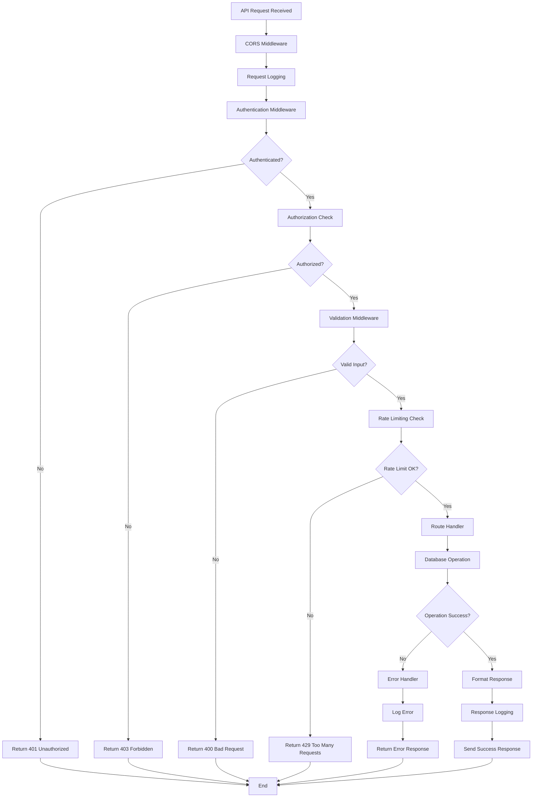

### 5.2 Use Case Diagram - BSDMS
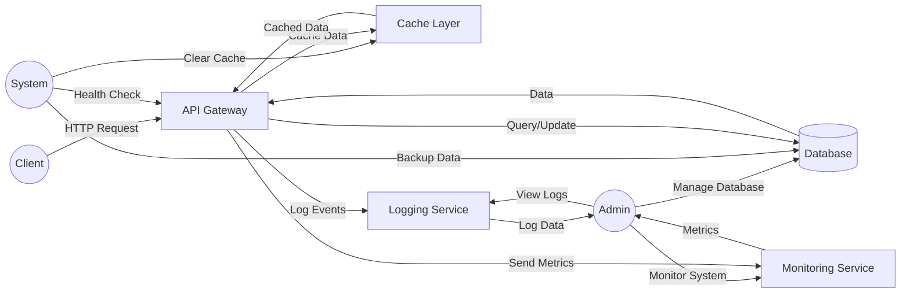

### 5.3 Sequence Diagram - BSDMS
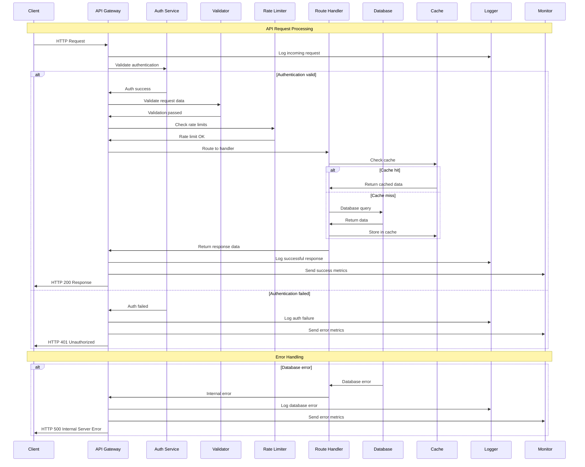

### 5.4 Class Diagram - BSDMS
```mermaid
classDiagram
    class APIServer {
        +Number port
        +Object config
        +Array routes
        +Array middleware
        +start()
        +stop()
        +addRoute()
        +addMiddleware()
        +handleRequest()
    }
    
    class DatabaseManager {
        +String connectionString
        +Object connection
        +Object pool
        +connect()
        +disconnect()
        +query()
        +transaction()
        +backup()
        +migrate()
    }
    
    class CacheManager {
        +String cacheType
        +Object config
        +Number defaultTTL
        +get()
        +set()
        +delete()
        +clear()
        +exists()
        +expire()
    }
    
    class ErrorHandler {
        +Object logger
        +Object config
        +handleError()
        +logError()
        +formatError()
        +sendErrorResponse()
        +notifyAdmin()
    }
    
    class Middleware {
        +String name
        +Number priority
        +execute()
        +validate()
        +authenticate()
        +authorize()
        +rateLimit()
        +cors()
    }
    
    class Logger {
        +String level
        +Object config
        +Array transports
        +info()
        +warn()
        +error()
        +debug()
        +createLogEntry()
        +rotate()
    }
    
    class MonitoringService {
        +Object metrics
        +Object alerts
        +collectMetrics()
        +sendAlert()
        +healthCheck()
        +generateReport()
        +trackPerformance()
    }
    
    class SecurityManager {
        +Object config
        +validateToken()
        +hashPassword()
        +encryptData()
        +decryptData()
        +sanitizeInput()
        +preventInjection()
    }
    
    APIServer ||--o{ DatabaseManager : uses
    APIServer ||--o{ CacheManager : uses
    APIServer ||--o{ ErrorHandler : uses
    APIServer ||--o{ Middleware : uses
    APIServer ||--o{ Logger : uses
    APIServer ||--o{ MonitoringService : uses
    APIServer ||--o{ SecurityManager : uses
    
    ErrorHandler --> Logger : logs
    MonitoringService --> Logger : logs
    Middleware --> SecurityManager : validates
    DatabaseManager --> Logger : logs
```

---

## Summary

This document contains all 20 diagrams (4 types × 5 subsystems) for the RTX Cinema system:

### Diagram Types per Subsystem:
1. **Activity Diagram** - Shows the flow of activities and decision points
2. **Use Case Diagram** - Shows interactions between actors and system
3. **Sequence Diagram** - Shows message flow over time
4. **Class Diagram** - Shows system structure and relationships

### 5 Subsystems:
1. **UAAS** - User Authentication & Authorization System
2. **ECNS** - Email Communication & Notification System  
3. **MCCMS** - Movie Catalog & Content Management System
4. **UIES** - User Interface & Experience System
5. **BSDMS** - Backend Services & Data Management System

All diagrams are in Mermaid format and can be rendered using the HTML file or online Mermaid editors.