                


Project and Professionalism (6CS007)
Artefact Design


RTX Cinema: Movie Booking Platform


Full Name: [Your Name]
Student Number: [Your Student Number]
Course: BSc (Hons) Computing
University Email Address: [Your Email]
Supervisor: [Supervisor Name]
Reader: [Reader Name]
Date of Submission: 2025/12/26

Abstract
RTX Cinema is a comprehensive digital movie booking platform that revolutionizes the cinema experience through integrated user management, movie catalog browsing, and seamless authentication systems. The application addresses the growing demand for digital cinema services by providing a unified platform that combines user registration, email verification, movie discovery, and personalized user experiences. Unlike traditional cinema websites that focus solely on ticket booking, RTX Cinema provides an all-in-one solution that integrates secure authentication with engaging movie browsing and user-centric design. The modern technology stack of React, Node.js, MongoDB, and supporting libraries enables RTX Cinema's responsive design, real-time email verification, and personalized movie recommendations. The project utilizes Agile development methodology to create an adaptable development process that allows for continuous improvements through user feedback. RTX Cinema provides immediate access to movie information while building a foundation for future booking functionality and enhanced user engagement.


Table of Contents
1.	Introduction	1
1.1.	Purpose	1
1.2.	Subsystems	1
1.2.1.	User Authentication & Authorization System	1
1.2.2.	Email Communication & Notification System	1
1.2.3.	Movie Catalog & Content Management System	1
1.2.4.	User Interface & Experience System	2
1.2.5.	Backend Services & Data Management System	2
1.3.	Functional Decomposition Diagram (FDD)	2
2.	Overall Description	3
2.1.	Product Perspective	3
2.2.	Product Functions	3
2.3.	Stakeholders	3
2.4.	Operating Environment	3
2.5.	Design and Implementation	4
2.6.	Assumptions and Dependencies	4
3.	System Requirements	5
3.1.	User Authentication & Authorization System (UAAS)	5
3.2.	Email Communication & Notification System (ECNS)	8
3.3.	Movie Catalog & Content Management System (MCCMS)	11
3.4.	User Interface & Experience System (UIES)	13
3.5.	Backend Services & Data Management System (BSDMS)	15
4.	System Design (Whole System Level)	17
5.	Entity Relationship Diagram (ERD)	19
6.	Data Dictionary	20
6.1.	User Table	20
6.2.	EmailVerification Table	20
6.3.	PasswordReset Table	20
6.4.	Movie Table	21
7.	Wireframes	22


 
1.	Introduction
1.1.	Purpose
This SRS document specifies the functional, non-functional, and usability requirements for RTX Cinema, a web-based movie booking platform. RTX Cinema combines user authentication, email verification, movie catalog browsing, responsive user interface, and robust backend services to provide users with a comprehensive cinema experience. The organization of this SRS is done according to the subsystems as shown in the Functional Decomposition Diagram (FDD). The Agile development approach is followed for development, which allows for continuous workflow, incremental delivery, and iterative enhancement by dealing with one subsystem at a time.

1.2.	Subsystems
RTX Cinema includes the following subsystems:

1.2.1.	User Authentication & Authorization System
It is responsible for secure user registration, login, logout, password management, and Google OAuth integration with comprehensive session management.

1.2.2.	Email Communication & Notification System
This subsystem handles email verification during registration, welcome emails, password reset notifications, and ensures reliable email delivery through multiple service providers.

1.2.3.	Movie Catalog & Content Management System
It enables users to browse movies by categories (Top Rated, Action, Coming Soon), view movie details, ratings, and provides organized content display with search capabilities.

1.2.4.	User Interface & Experience System
It provides responsive web interface with intuitive navigation, dark cinema theme, interactive components, and seamless user experience across different devices.

1.2.5.	Backend Services & Data Management System
It manages RESTful API endpoints, database operations, middleware services, error handling, and ensures secure data persistence with MongoDB integration.

1.3.	Functional Decomposition Diagram (FDD)
The Functional Decomposition diagram is given below:

```
                    RTX Cinema System
                           |
        ┌─────────────────┼─────────────────┐
        |                 |                 |
   User Auth &      Email Comm &       Movie Catalog &
   Authorization    Notification       Content Mgmt
        |                 |                 |
   ┌────┼────┐       ┌────┼────┐       ┌────┼────┐
   |    |    |       |    |    |       |    |    |
 Login Reg OAuth   Verify Welcome    Browse Search View
                   Email  Email      Movies Filter Details
        
        |                                   |
   UI & Experience                 Backend Services &
        |                         Data Management
   ┌────┼────┐                         |
   |    |    |                    ┌────┼────┐
 Navigation Theme Responsive      API  DB   Error
 Components Design Layout        Routes Ops Handling
```

Figure 1 FDD Diagram

2.	Overall Description
2.1.	Product Perspective
RTX Cinema is a digital movie booking platform addressing the growing demand for online cinema services, integrating user authentication, email verification, movie browsing, responsive design, and backend services in one application. Unlike single-purpose movie websites, it promotes comprehensive user engagement and long-term platform loyalty, built with React, Node.js, MongoDB, and managed via Agile methodology for flexible development.

2.2.	Product Functions
•	Users register/login with email verification, browse movies by categories, view detailed movie information, manage user profiles, and receive email notifications.
•	System ensures secure authentication, real-time email verification, responsive movie display, and comprehensive data management.
•	Platform provides intuitive navigation, dark cinema theme, and seamless user experience across devices.

2.3.	Stakeholders
•	End Users: Movie enthusiasts who register and use RTX Cinema to browse movies and manage accounts.
•	System Administrators: Technical staff who maintain system security, monitor performance, and manage backend services.
•	Guests: Visitors who can view the platform but require registration for full access.

2.4.	Operating Environment
•	Frontend: React.js with Vite, compatible with modern browsers (Chrome, Firefox, Safari, Edge).
•	Backend: Node.js with Express framework for RESTful API services.
•	Database: MongoDB for document-based data storage and retrieval.
•	Third-Party: Google OAuth for authentication, SendGrid/Gmail for email services, external movie APIs.
•	Network: Internet connection required; HTTPS-secured communications.

2.5.	Design and Implementation
•	Use Agile development methodology for iterative development.
•	Ensure data privacy compliance and user consent management.
•	Email verification is mandatory for account activation.
•	Web-based responsive design; mobile-friendly interface.

2.6.	Assumptions and Dependencies
•	Users have stable internet access for real-time features and email verification.
•	Third-party services (Google OAuth, email providers) are available and reliable.
•	MongoDB database efficiently handles document-based data operations.
•	No integration with external payment systems in current version.

3.	System Requirements
Requirements are grouped by subsystem, each with a code (e.g., UAAS-F-1.0), description, and use case.

Legend:
Types of Requirements
•	F: Functional Requirement
•	NF: Non-Functional Requirement
•	UR: Usability Requirement

Subsystems
•	UAAS: User Authentication & Authorization System
•	ECNS: Email Communication & Notification System
•	MCCMS: Movie Catalog & Content Management System
•	UIES: User Interface & Experience System
•	BSDMS: Backend Services & Data Management System

3.1.	User Authentication & Authorization System (UAAS)

Code	Descriptions	Use Case
UAAS-F-1.0	Users can register with email, password, and confirm password fields.	Register user
UAAS-NF-1.1	Registration data must be encrypted during transmission using HTTPS.	Register user
UAAS-NF-1.2	Passwords must be at least 8 characters with letters and numbers.	Register user
UAAS-UR-1.1	Password fields shall have show/hide toggle functionality.	Register user
UAAS-UR-1.2	Real-time validation for email format and password strength.	Register user
UAAS-F-2.0	Users can log in with email/password or Google OAuth.	Login user
UAAS-NF-2.1	Sessions must use secure authentication tokens.	Login user
UAAS-F-3.0	Users can reset passwords via email verification code.	Reset password
UAAS-UR-3.1	Reset form validates new password matches confirmation.	Reset password
UAAS-F-4.0	Users can update profile information and preferences.	Update profile
UAAS-F-5.0	System must verify email addresses before account activation.	Verify email
UAAS-NF-5.1	Verification codes expire after 15 minutes for security.	Verify email

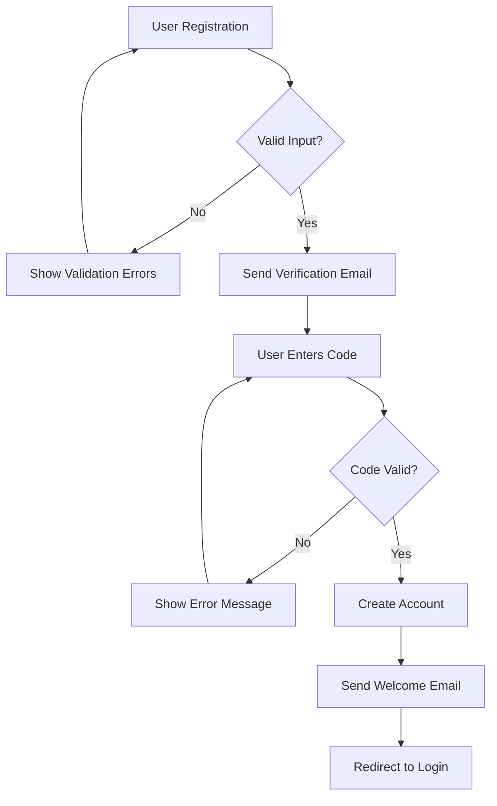
Figure 2 Activity Diagram for UAAS

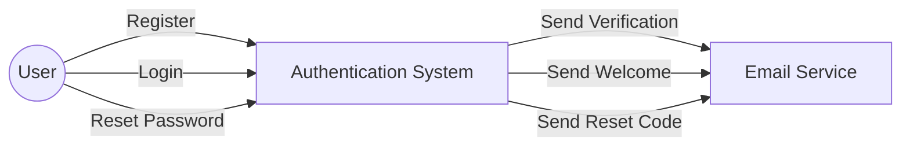
Figure 3 Use-Case Diagram for UAAS

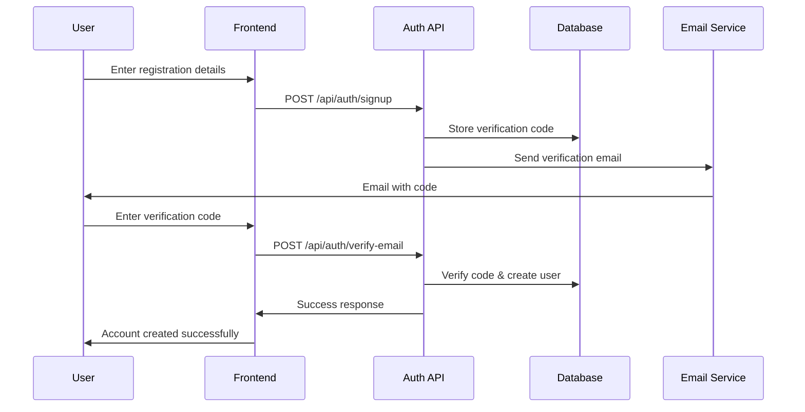
Figure 4 Sequence Diagram for UAAS

```mermaid
classDiagram
    class User {
        +String id
        +String login
        +String email
        +String password
        +String name
        +String googleId
        +String authMethod
        +Date createdAt
        +Date updatedAt
        +register()
        +login()
        +resetPassword()
        +updateProfile()
    }
    
    class EmailVerification {
        +String id
        +String email
        +String code
        +Object userData
        +String verificationType
        +Date createdAt
        +Date expiresAt
        +generateCode()
        +validateCode()
        +isExpired()
    }
    
    User ||--o{ EmailVerification : verifies
```
Figure 5 Class Diagram for UAAS

3.2.	Email Communication & Notification System (ECNS)

Code	Descriptions	Use Case
ECNS-F-1.0	System sends verification emails with 6-digit codes during registration.	Send verification
ECNS-NF-1.1	Email delivery must be reliable with fallback providers.	Send verification
ECNS-UR-1.1	Verification emails shall have clear instructions and professional design.	Send verification
ECNS-F-2.0	System sends welcome emails after successful account creation.	Send welcome
ECNS-NF-2.1	Welcome emails must include platform features and getting started guide.	Send welcome
ECNS-F-3.0	System sends password reset codes via email.	Send reset code
ECNS-UR-3.1	Reset emails shall include security warnings and expiration time.	Send reset code
ECNS-F-4.0	Users can resend verification codes if not received.	Resend verification
ECNS-NF-4.1	Rate limiting prevents spam and abuse of email services.	Resend verification

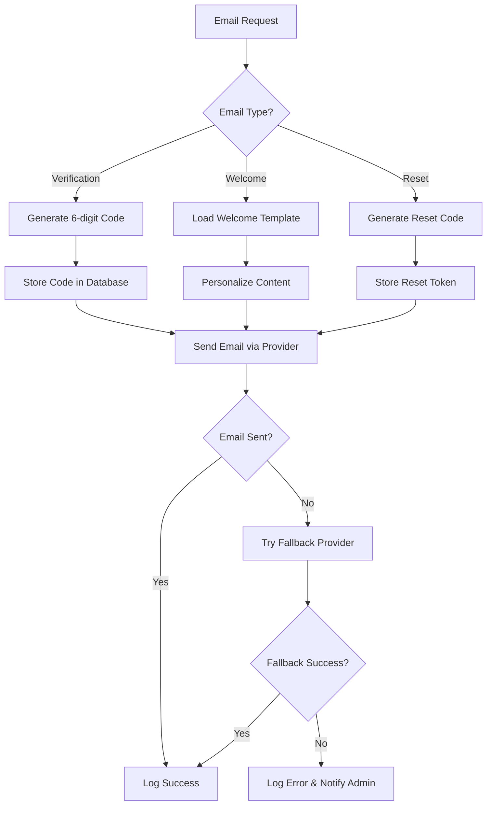
Figure 6 Activity Diagram for ECNS

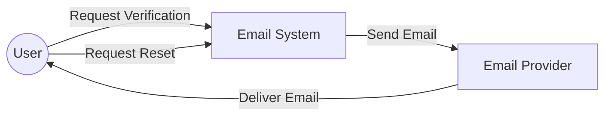
Figure 7 Use-Case Diagram for ECNS

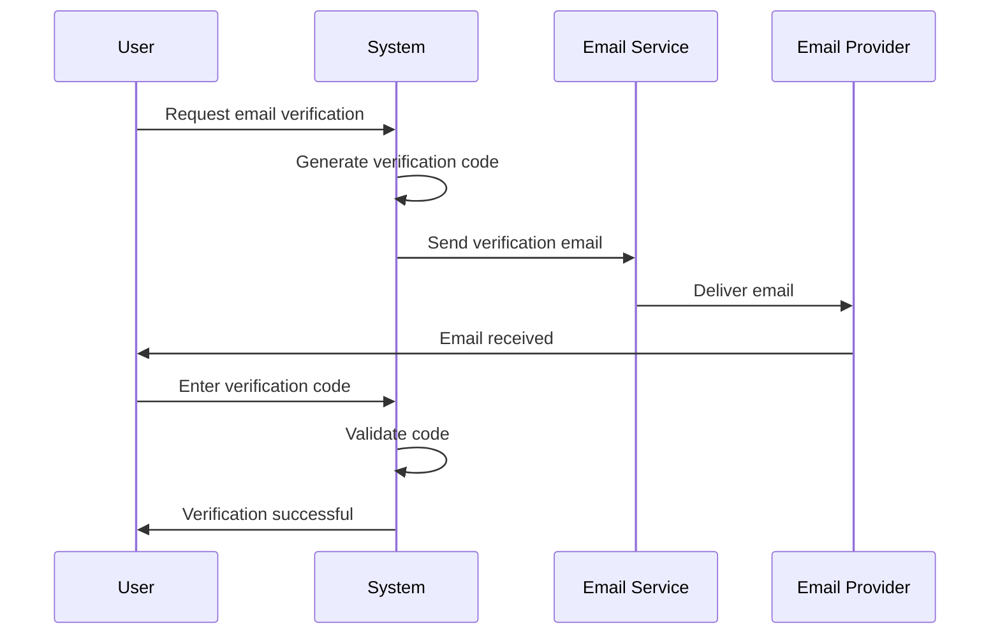
Figure 8 Sequence Diagram for ECNS

```mermaid
classDiagram
    class EmailService {
        +String provider
        +Object config
        +sendVerificationEmail()
        +sendWelcomeEmail()
        +sendResetEmail()
        +generateCode()
        +validateTemplate()
    }
    
    class EmailTemplate {
        +String type
        +String subject
        +String htmlContent
        +String textContent
        +Object variables
        +render()
        +personalize()
    }
    
    class EmailLog {
        +String id
        +String recipient
        +String type
        +String status
        +Date sentAt
        +String provider
        +logDelivery()
        +trackStatus()
    }
    
    EmailService ||--o{ EmailTemplate : uses
    EmailService ||--o{ EmailLog : creates
```
Figure 9 Class Diagram for ECNS

3.3.	Movie Catalog & Content Management System (MCCMS)

Code	Descriptions	Use Case
MCCMS-F-1.0	Users can browse movies by categories (Top Rated, Action, Coming Soon).	Browse movies
MCCMS-NF-1.1	Movie data must load quickly with optimized images and caching.	Browse movies
MCCMS-UR-1.1	Movie cards shall display title, rating, genre, and poster image.	Browse movies
MCCMS-F-2.0	Users can view detailed movie information including cast and synopsis.	View movie details
MCCMS-NF-2.1	Movie details must be accurate and up-to-date.	View movie details
MCCMS-F-3.0	Users can search movies by title, genre, or year.	Search movies
MCCMS-UR-3.1	Search shall provide auto-complete suggestions and filters.	Search movies
MCCMS-F-4.0	System displays movie ratings and user reviews.	View ratings
MCCMS-NF-4.1	Rating calculations must be accurate and real-time.	View ratings

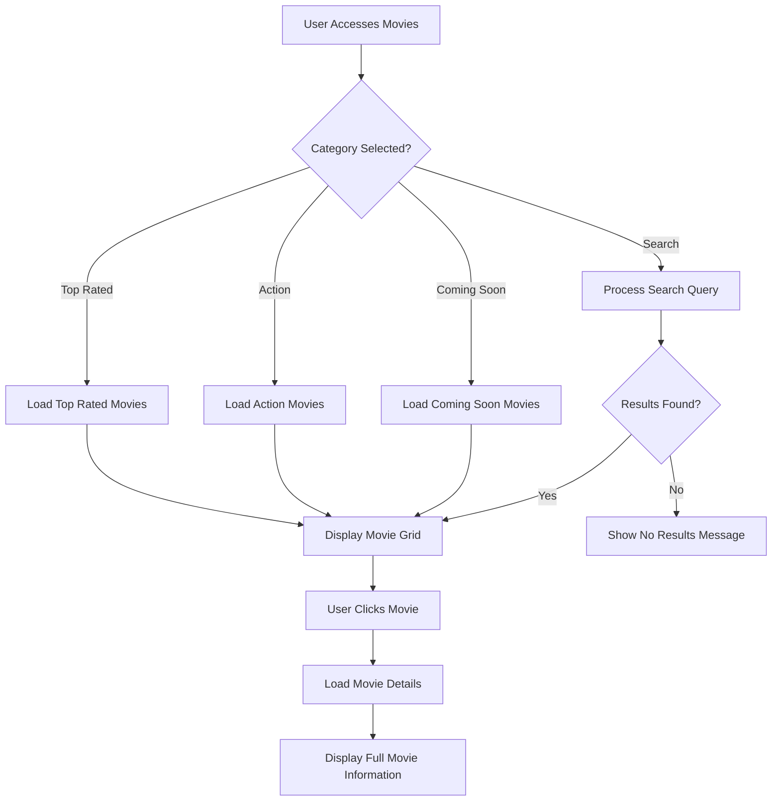
Figure 10 Activity Diagram for MCCMS

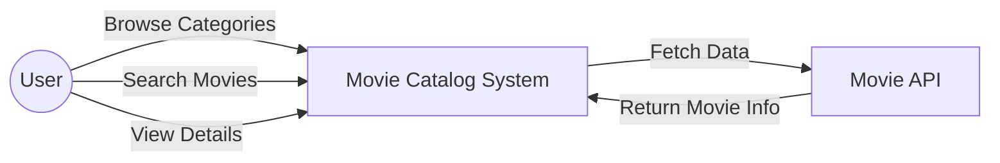
Figure 11 Use-Case Diagram for MCCMS

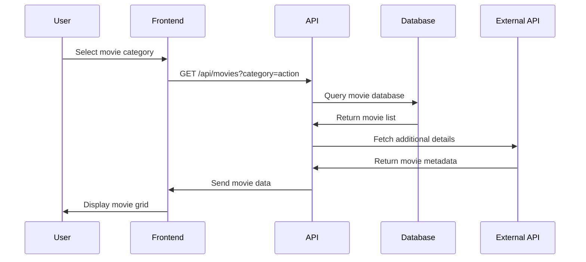
Figure 12 Sequence Diagram for MCCMS

```mermaid
classDiagram
    class Movie {
        +String id
        +String title
        +Number rating
        +String genre
        +String year
        +String image
        +String synopsis
        +Array cast
        +String category
        +Date releaseDate
        +getDetails()
        +updateRating()
        +addReview()
    }
    
    class Category {
        +String id
        +String name
        +String description
        +Array movies
        +addMovie()
        +removeMovie()
        +getMovies()
    }
    
    class Review {
        +String id
        +String movieId
        +String userId
        +Number rating
        +String comment
        +Date createdAt
        +validate()
        +moderate()
    }
    
    Movie ||--o{ Review : has
    Category ||--o{ Movie : contains
```
Figure 13 Class Diagram for MCCMS

3.4.	User Interface & Experience System (UIES)

Code	Descriptions	Use Case
UIES-F-1.0	System provides responsive design that works on desktop, tablet, and mobile.	Access platform
UIES-NF-1.1	Interface must load within 3 seconds on standard internet connections.	Access platform
UIES-UR-1.1	Navigation shall be intuitive with clear visual hierarchy.	Navigate platform
UIES-F-2.0	System implements dark cinema theme with red accent colors.	View interface
UIES-NF-2.1	Color contrast must meet accessibility standards (WCAG 2.1).	View interface
UIES-F-3.0	Users can navigate between login, signup, and home pages seamlessly.	Navigate pages
UIES-UR-3.1	Page transitions shall be smooth without full page reloads.	Navigate pages
UIES-F-4.0	System provides interactive components with hover effects and animations.	Interact with UI
UIES-UR-4.1	Interactive elements shall provide clear feedback on user actions.	Interact with UI

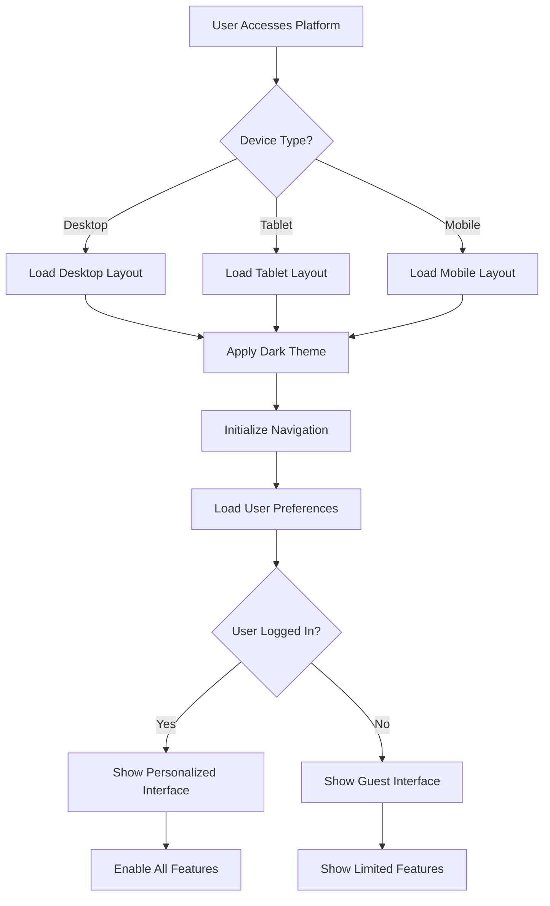
Figure 14 Activity Diagram for UIES

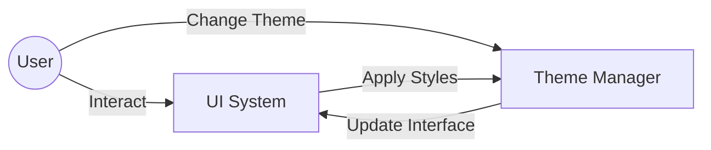
Figure 15 Use-Case Diagram for UIES

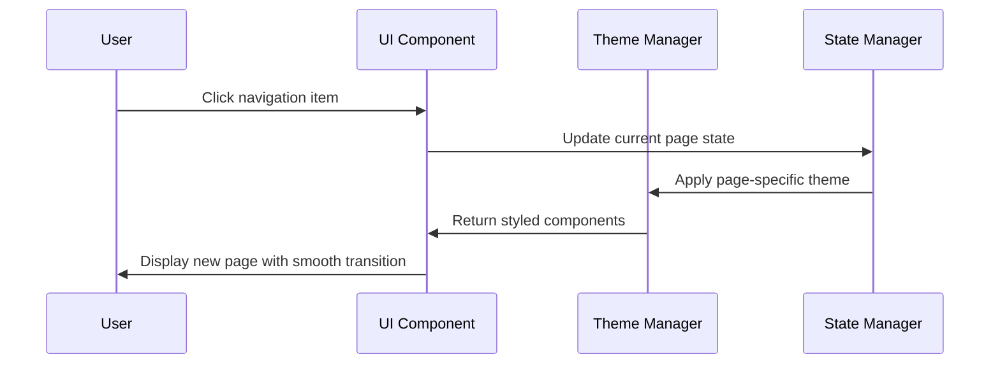
Figure 16 Sequence Diagram for UIES

```mermaid
classDiagram
    class UIComponent {
        +String id
        +Object props
        +Object state
        +String theme
        +render()
        +handleEvents()
        +updateState()
    }
    
    class ThemeManager {
        +Object darkTheme
        +Object lightTheme
        +String currentTheme
        +applyTheme()
        +toggleTheme()
        +getColors()
    }
    
    class NavigationManager {
        +Array routes
        +String currentRoute
        +Object history
        +navigate()
        +goBack()
        +updateRoute()
    }
    
    UIComponent ||--o{ ThemeManager : uses
    UIComponent ||--o{ NavigationManager : uses
```
Figure 17 Class Diagram for UIES

3.5.	Backend Services & Data Management System (BSDMS)

Code	Descriptions	Use Case
BSDMS-F-1.0	System provides RESTful API endpoints for all frontend operations.	Handle API requests
BSDMS-NF-1.1	API responses must be consistent and follow standard HTTP status codes.	Handle API requests
BSDMS-UR-1.1	API documentation shall be clear and comprehensive.	Handle API requests
BSDMS-F-2.0	System manages MongoDB database connections and operations.	Manage data
BSDMS-NF-2.1	Database operations must be optimized for performance and scalability.	Manage data
BSDMS-F-3.0	System implements comprehensive error handling and logging.	Handle errors
BSDMS-UR-3.1	Error messages shall be user-friendly and informative.	Handle errors
BSDMS-F-4.0	System provides middleware for authentication, validation, and CORS.	Process requests
BSDMS-NF-4.1	Middleware must be secure and prevent common web vulnerabilities.	Process requests

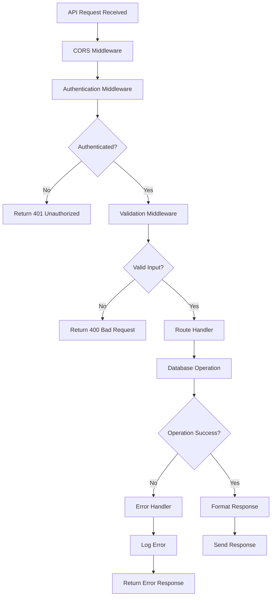
Figure 18 Activity Diagram for BSDMS

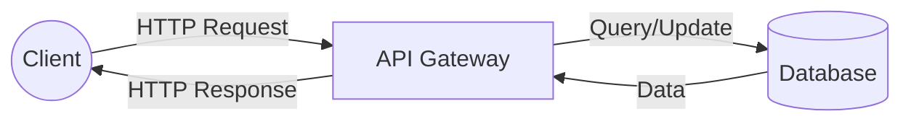
Figure 19 Use-Case Diagram for BSDMS

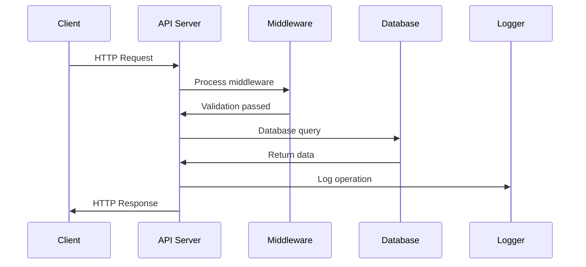
Figure 20 Sequence Diagram for BSDMS

```mermaid
classDiagram
    class APIServer {
        +Number port
        +Object config
        +Array routes
        +Array middleware
        +start()
        +stop()
        +addRoute()
        +addMiddleware()
    }
    
    class DatabaseManager {
        +String connectionString
        +Object connection
        +connect()
        +disconnect()
        +query()
        +transaction()
    }
    
    class ErrorHandler {
        +Object logger
        +handleError()
        +logError()
        +formatError()
        +sendErrorResponse()
    }
    
    APIServer ||--o{ DatabaseManager : uses
    APIServer ||--o{ ErrorHandler : uses
```
Figure 21 Class Diagram for BSDMS

4.	System Design (Whole System Level)

```mermaid
graph TD
    A[User Accesses RTX Cinema] --> B{User Registered?}
    B -->|No| C[Show Registration Form]
    B -->|Yes| D[Show Login Form]
    C --> E[User Submits Registration]
    E --> F[Send Verification Email]
    F --> G[User Verifies Email]
    G --> H[Account Created]
    H --> I[User Logs In]
    D --> I
    I --> J[Load Home Page]
    J --> K[Display Movie Categories]
    K --> L[User Browses Movies]
    L --> M{User Action?}
    M -->|View Details| N[Show Movie Details]
    M -->|Search| O[Process Search]
    M -->|Change Category| P[Load Category Movies]
    M -->|Logout| Q[End Session]
    N --> L
    O --> L
    P --> L
```
Figure 22 Activity Diagram for the Whole System

```mermaid
graph LR
    User((User))
    Guest((Guest))
    Admin((Admin))
    
    RTXCinema[RTX Cinema System]
    
    User --> |Register/Login| RTXCinema
    User --> |Browse Movies| RTXCinema
    User --> |Manage Profile| RTXCinema
    Guest --> |View Landing Page| RTXCinema
    Admin --> |Monitor System| RTXCinema
    
    RTXCinema --> |Send Emails| User
    RTXCinema --> |Display Movies| User
    RTXCinema --> |Authenticate| User
```
Figure 23 Use-Case Diagram for the Whole System

```mermaid
sequenceDiagram
    participant U as User
    participant F as Frontend
    participant A as API Server
    participant D as Database
    participant E as Email Service
    participant M as Movie Service
    
    U->>F: Access RTX Cinema
    F->>A: Request initial data
    A->>D: Query user session
    D->>A: Return session data
    A->>F: Send user status
    F->>U: Display appropriate interface
    
    U->>F: Register account
    F->>A: POST /api/auth/signup
    A->>D: Store verification data
    A->>E: Send verification email
    E->>U: Email with code
    
    U->>F: Verify email
    F->>A: POST /api/auth/verify
    A->>D: Create user account
    A->>F: Account created
    
    U->>F: Browse movies
    F->>A: GET /api/movies
    A->>M: Fetch movie data
    M->>A: Return movies
    A->>F: Send movie list
    F->>U: Display movies
```
Figure 24 Sequence Diagram for the Whole System

```mermaid
classDiagram
    class RTXCinemaSystem {
        +UserAuthSystem authSystem
        +EmailSystem emailSystem
        +MovieSystem movieSystem
        +UISystem uiSystem
        +BackendSystem backendSystem
        +initialize()
        +shutdown()
        +handleRequest()
    }
    
    class UserAuthSystem {
        +register()
        +login()
        +logout()
        +resetPassword()
        +verifyEmail()
    }
    
    class EmailSystem {
        +sendVerification()
        +sendWelcome()
        +sendReset()
        +validateTemplate()
    }
    
    class MovieSystem {
        +getMovies()
        +searchMovies()
        +getMovieDetails()
        +getCategories()
    }
    
    class UISystem {
        +renderPage()
        +handleNavigation()
        +applyTheme()
        +updateState()
    }
    
    class BackendSystem {
        +handleAPI()
        +manageDatabase()
        +processMiddleware()
        +handleErrors()
    }
    
    RTXCinemaSystem ||--o{ UserAuthSystem : contains
    RTXCinemaSystem ||--o{ EmailSystem : contains
    RTXCinemaSystem ||--o{ MovieSystem : contains
    RTXCinemaSystem ||--o{ UISystem : contains
    RTXCinemaSystem ||--o{ BackendSystem : contains
```
Figure 25 Class Diagram for the Whole System

5.	Entity Relationship Diagram (ERD)

```mermaid
erDiagram
    USER {
        ObjectId _id PK
        String login UK
        String email
        String password
        String name
        String googleId
        String authMethod
        Date createdAt
        Date updatedAt
    }
    
    EMAIL_VERIFICATION {
        ObjectId _id PK
        String email FK
        String code
        Object userData
        String verificationType
        Date createdAt
        Date expiresAt
    }
    
    PASSWORD_RESET {
        ObjectId _id PK
        String email FK
        String code
        Date createdAt
        Date expiresAt
    }
    
    MOVIE {
        ObjectId _id PK
        String title
        Number rating
        String genre
        String year
        String image
        String synopsis
        String category
        Date releaseDate
    }
    
    USER_SESSION {
        ObjectId _id PK
        ObjectId userId FK
        String token
        Date createdAt
        Date expiresAt
    }
    
    USER ||--o{ EMAIL_VERIFICATION : "verifies email"
    USER ||--o{ PASSWORD_RESET : "requests reset"
    USER ||--o{ USER_SESSION : "has sessions"
```
Figure 26 Entity Relationship Diagram (ERD)

6.	Data Dictionary

6.1.	User Table
Field	Type	Null	Key	Description
_id	ObjectId	No	PK	Unique identifier for each user
login	String	No	Unique	Username for login
email	String	Yes		User email address
password	String	Conditional		Hashed password (required for email auth)
name	String	Yes		Full name of the user
googleId	String	Yes		Google OAuth identifier
authMethod	String	No		Authentication method: 'email' or 'google'
createdAt	Date	No		Account creation timestamp
updatedAt	Date	No		Last update timestamp

6.2.	EmailVerification Table
Field	Type	Null	Key	Description
_id	ObjectId	No	PK	Unique verification record ID
email	String	No		Email address to verify
code	String	No		6-digit verification code
userData	Object	No		Temporary user data during verification
verificationType	String	No		Type: 'signup' or 'google-signup'
createdAt	Date	No		Verification request timestamp
expiresAt	Date	No		Code expiration time (15 minutes)

6.3.	PasswordReset Table
Field	Type	Null	Key	Description
_id	ObjectId	No	PK	Unique reset request ID
email	String	No		Email address for password reset
code	String	No		6-digit reset code
createdAt	Date	No		Reset request timestamp
expiresAt	Date	No		Code expiration time (15 minutes)

6.4.	Movie Table
Field	Type	Null	Key	Description
_id	ObjectId	No	PK	Unique movie identifier
title	String	No		Movie title
rating	Number	No		Movie rating (0-10 scale)
genre	String	No		Movie genre(s)
year	String	No		Release year
image	String	No		Movie poster URL
synopsis	String	Yes		Movie description
category	String	No		Category: 'top-rated', 'action', 'coming-soon'
releaseDate	Date	Yes		Official release date

7.	Wireframes
The wireframes for RTX Cinema system are given below:

Landing/Login Page:
```
┌─────────────────────────────────────────────────────────────┐
│                    RTX Cinema Login                         │
├─────────────────────────────────────────────────────────────┤
│  [Cinema Image]           │  Welcome to RTX Cinema          │
│                           │                                 │
│                           │  Login: [________________]      │
│                           │                                 │
│                           │  Password: [________________]   │
│                           │            [👁️]                │
│                           │                                 │
│                           │  [Lost Password? Reset]         │
│                           │                                 │
│                           │  [        Login        ]       │
│                           │                                 │
│                           │  Don't have account? [Sign Up]  │
│                           │                                 │
│                           │  [🧪 Test Email System]        │
│                           │                                 │
│                           │  [Sign in with Google]          │
│                           │                                 │
│                           │  © 2020-2021, PT TIX ID        │
└─────────────────────────────────────────────────────────────┘
```

Registration Page:
```
┌─────────────────────────────────────────────────────────────┐
│                    Create Account                           │
├─────────────────────────────────────────────────────────────┤
│                                                             │
│  Email: [_________________________________]                │
│                                                             │
│  Username: [_________________________________]             │
│                                                             │
│  Password: [_________________________________] [👁️]        │
│                                                             │
│  Confirm Password: [_________________________________]      │
│                                                             │
│  [        Create Account        ]                          │
│                                                             │
│  Already have account? [Back to Login]                     │
│                                                             │
│  [Sign up with Google]                                     │
│                                                             │
└─────────────────────────────────────────────────────────────┘
```

Email Verification Page:
```
┌─────────────────────────────────────────────────────────────┐
│                  Email Verification                         │
├─────────────────────────────────────────────────────────────┤
│                                                             │
│  We've sent a verification code to:                        │
│  user@example.com                                          │
│                                                             │
│  Enter the 6-digit code:                                   │
│  [___] [___] [___] [___] [___] [___]                       │
│                                                             │
│  [        Verify Email        ]                            │
│                                                             │
│  Didn't receive code? [Resend Code]                        │
│                                                             │
│  [← Back to Signup]                                        │
│                                                             │
└─────────────────────────────────────────────────────────────┘
```

Home Page:
```
┌─────────────────────────────────────────────────────────────┐
│ 🎬 RTX Cinema    Movies Series Animation Genres    🔍 Subscribe 🔔 User ▼ │
├─────────────────────────────────────────────────────────────┤
│ │🔍 Discovery    │                                          │
│ │⭐ Top Rated    │  Top Rated Movies                        │
│ │🕐 Coming Soon  │  ┌─────┐ ┌─────┐ ┌─────┐ ┌─────┐        │
│ │🎬 Recent       │  │  1  │ │  2  │ │  3  │ │  4  │        │
│ │📥 Download     │  │[IMG]│ │[IMG]│ │[IMG]│ │[IMG]│        │
│ │🌙 Dark Mode    │  │Title│ │Title│ │Title│ │Title│        │
│ │⚙️ Settings     │  │⭐9.2│ │⭐9.2│ │⭐9.0│ │⭐8.9│        │
│ │                │  └─────┘ └─────┘ └─────┘ └─────┘        │
│ │                │                                          │
│ │                │  Best of Action                          │
│ │                │  ┌─────┐ ┌─────┐ ┌─────┐ ┌─────┐        │
│ │                │  │[IMG]│ │[IMG]│ │[IMG]│ │[IMG]│        │
│ │                │  │ ▶   │ │ ▶   │ │ ▶   │ │ ▶   │        │
│ │                │  │Title│ │Title│ │Title│ │Title│        │
│ │                │  │⭐4.8│ │⭐4.8│ │⭐4.6│ │⭐4.8│        │
│ │                │  └─────┘ └─────┘ └─────┘ └─────┘        │
└─────────────────────────────────────────────────────────────┘
```

Forgot Password Page:
```
┌─────────────────────────────────────────────────────────────┐
│                  Reset Password                             │
├─────────────────────────────────────────────────────────────┤
│                                                             │
│  Enter your email to receive reset code:                   │
│                                                             │
│  Email: [_________________________________]                │
│                                                             │
│  [        Send Reset Code        ]                         │
│                                                             │
│  [← Back to Login]                                         │
│                                                             │
└─────────────────────────────────────────────────────────────┘
```

Email Test Page:
```
┌─────────────────────────────────────────────────────────────┐
│                  Email System Test                          │
├─────────────────────────────────────────────────────────────┤
│                                                             │
│  Test email delivery:                                      │
│                                                             │
│  Email: [_________________________________]                │
│                                                             │
│  [        Send Test Email        ]                         │
│                                                             │
│  Status: [                                    ]            │
│                                                             │
│  [← Back to Login]                                         │
│                                                             │
└─────────────────────────────────────────────────────────────┘
```