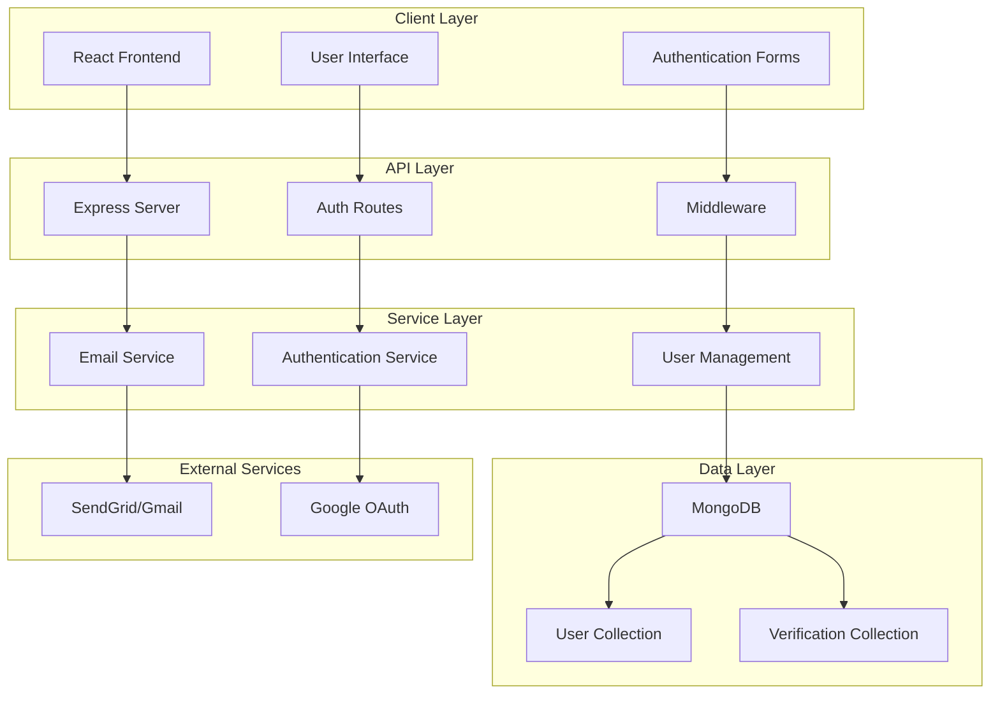
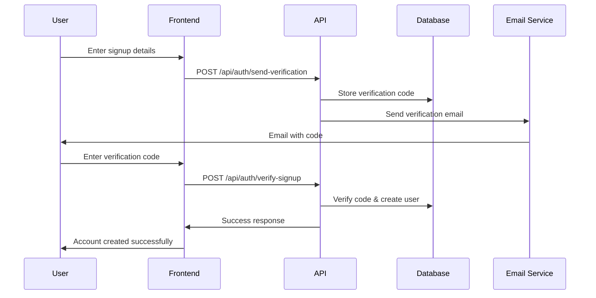

# RTX Cinema - System Design Report
**Movie Booking Platform**

---

## Table of Contents
1. [System Overview](#system-overview)
2. [System Architecture](#system-architecture)
3. [Subsystem Design](#subsystem-design)
4. [Database Design](#database-design)
5. [API Design](#api-design)
6. [User Interface Design](#user-interface-design)
7. [Security Considerations](#security-considerations)
8. [Technology Stack](#technology-stack)

---

## System Overview

### Project Description
RTX Cinema is a full-stack movie booking platform that provides users with a comprehensive cinema experience. The system allows users to browse movies, create accounts, manage authentication, and interact with a modern cinema interface.

### System Objectives
- Provide secure user authentication and authorization
- Enable seamless movie browsing and categorization
- Implement reliable email communication system
- Deliver responsive and intuitive user interface
- Ensure robust backend services and data management

### Key Features
- User Registration and Login (Email & Google OAuth)
- Email Verification and Password Reset
- Movie Catalog with Multiple Categories
- Responsive Web Interface
- Real-time User Session Management

---

## System Architecture

### Overall Architecture Pattern
The RTX Cinema system follows a **3-Tier Architecture** pattern:

```
┌─────────────────────────────────────────────────────────────┐
│                    PRESENTATION TIER                        │
│                   (React Frontend)                          │
├─────────────────────────────────────────────────────────────┤
│                    APPLICATION TIER                         │
│                 (Node.js/Express API)                       │
├─────────────────────────────────────────────────────────────┤
│                      DATA TIER                              │
│                   (MongoDB Database)                        │
└─────────────────────────────────────────────────────────────┘
```

### Communication Flow
```
User Interface ←→ REST API ←→ Business Logic ←→ Database
     ↓              ↓              ↓              ↓
  React.js    Express Routes   Controllers   MongoDB
```

---

## Subsystem Design

### 1. User Authentication & Authorization Subsystem

**Purpose**: Manages user registration, login, session management, and access control.

**Components**:
- Login Page Component
- Signup Page Component  
- Google OAuth Integration
- JWT Token Management
- Session Validation

**Key Functions**:
- User registration with email verification
- Secure login with password hashing
- Google OAuth integration
- Password reset functionality
- Session management

**Technologies**: React, Google OAuth, bcrypt, JWT

**Database Tables**: Users, EmailVerification, PasswordReset

---

### 2. Email Communication & Notification Subsystem

**Purpose**: Handles all email communications including verification, welcome messages, and password resets.

**Components**:
- Email Service Layer
- Email Templates
- Verification Code Generator
- Email Testing Interface

**Key Functions**:
- Send verification emails
- Send welcome emails
- Send password reset codes
- Email template management
- Email delivery tracking

**Technologies**: Nodemailer, SendGrid, HTML Templates

**Database Tables**: EmailVerification, PasswordReset

---

### 3. Movie Catalog & Content Management Subsystem

**Purpose**: Manages movie data, categorization, and content display.

**Components**:
- Movie Data Models
- Category Management
- Movie Display Components
- Search and Filter Logic

**Key Functions**:
- Movie categorization (Top Rated, Action, Coming Soon)
- Movie information display
- Rating and genre management
- Movie image handling
- Content organization

**Technologies**: React, JavaScript, CSS

**Database Tables**: Movies (future implementation)

---

### 4. User Interface & Experience Subsystem

**Purpose**: Provides responsive and intuitive user interface across all application features.

**Components**:
- Navigation Components
- Layout Management
- Responsive Design
- Theme Management
- User Interaction Handlers

**Key Functions**:
- Sidebar navigation
- Header navigation
- Responsive layout
- Dark mode toggle
- User menu management
- Search interface

**Technologies**: React, CSS3, Responsive Design

---

### 5. Backend Services & Data Management Subsystem

**Purpose**: Provides core backend functionality, API services, and data persistence.

**Components**:
- Express Server
- API Routes
- Database Connection
- Middleware Services
- Error Handling

**Key Functions**:
- RESTful API endpoints
- Database operations
- Request/Response handling
- CORS management
- Error logging and handling
- Data validation

**Technologies**: Node.js, Express, MongoDB, Mongoose

**Database Tables**: Users, EmailVerification, PasswordReset

---

## Database Design

### Entity Relationship Diagram

```
┌─────────────────┐     ┌─────────────────────┐     ┌─────────────────┐
│      Users      │     │  EmailVerification  │     │  PasswordReset  │
├─────────────────┤     ├─────────────────────┤     ├─────────────────┤
│ _id (ObjectId)  │     │ _id (ObjectId)      │     │ _id (ObjectId)  │
│ login (String)  │────▶│ email (String)      │     │ email (String)  │
│ email (String)  │     │ code (String)       │     │ code (String)   │
│ password (Hash) │     │ userData (Object)   │     │ createdAt (Date)│
│ name (String)   │     │ verificationType    │     │ expires (15min) │
│ googleId (Str)  │     │ createdAt (Date)    │     └─────────────────┘
│ authMethod (Str)│     │ expires (15min)     │
│ createdAt (Date)│     └─────────────────────┘
│ updatedAt (Date)│
└─────────────────┘
```

### Database Schema Details

**Users Collection**:
```javascript
{
  _id: ObjectId,
  login: String (required, unique),
  email: String (sparse, lowercase),
  password: String (hashed with bcrypt),
  name: String,
  googleId: String (sparse),
  authMethod: String (enum: ['email', 'google']),
  createdAt: Date,
  updatedAt: Date
}
```

**EmailVerification Collection**:
```javascript
{
  _id: ObjectId,
  email: String (required, lowercase),
  code: String (6-digit numeric),
  userData: Object (temporary user data),
  verificationType: String (enum: ['signup', 'google-signup']),
  createdAt: Date (expires after 15 minutes)
}
```

---

## API Design

### Authentication Endpoints

| Method | Endpoint | Description | Request Body | Response |
|--------|----------|-------------|--------------|----------|
| POST | `/api/auth/send-verification` | Send verification code | `{email, login, password}` | `{success, message, email}` |
| POST | `/api/auth/verify-signup` | Verify code and create account | `{email, code}` | `{success, message, user}` |
| POST | `/api/auth/login` | User login | `{login, password}` | `{success, message, user}` |
| POST | `/api/auth/google-login` | Google OAuth login | `{email, name, googleId}` | `{success, message, user}` |
| POST | `/api/auth/forgot-password` | Request password reset | `{email}` | `{success, message}` |
| POST | `/api/auth/reset-password` | Reset password | `{email, code, newPassword}` | `{success, message}` |
| POST | `/api/auth/test-email` | Test email functionality | `{email}` | `{success, message, code}` |

### API Response Format

**Success Response**:
```javascript
{
  success: true,
  message: "Operation completed successfully",
  data: { /* relevant data */ }
}
```

**Error Response**:
```javascript
{
  success: false,
  message: "Error description",
  errors: { /* field-specific errors */ }
}
```

---

## User Interface Design

### Page Structure

```
RTX Cinema Application
├── Login Page
│   ├── Login Form
│   ├── Google OAuth Button
│   ├── Forgot Password Link
│   └── Signup Link
├── Signup Page
│   ├── Registration Form
│   ├── Email Verification
│   └── Google OAuth Option
├── Home Page
│   ├── Sidebar Navigation
│   ├── Header Navigation
│   ├── Movie Categories
│   └── Movie Grid Display
├── Forgot Password Page
│   ├── Email Input
│   └── Reset Code Verification
└── Email Test Page
    └── Email Testing Interface
```

### Component Hierarchy

```
App
├── GoogleOAuthProvider
├── AppContent
│   ├── LoginPage
│   ├── SignupPage
│   ├── ForgotPasswordPage
│   ├── EmailTestPage
│   └── HomePage
│       ├── Sidebar
│       ├── Header
│       └── MovieGrid
```

### Design Principles
- **Responsive Design**: Mobile-first approach
- **Consistent Theming**: Dark cinema theme with red accents
- **User-Centric**: Intuitive navigation and clear feedback
- **Accessibility**: ARIA labels and keyboard navigation

---

## Security Considerations

### Authentication Security
- **Password Hashing**: bcrypt with salt rounds
- **JWT Tokens**: Secure session management
- **OAuth Integration**: Google OAuth 2.0
- **Email Verification**: Required for account activation

### Data Protection
- **Input Validation**: Server-side validation for all inputs
- **SQL Injection Prevention**: Mongoose ODM protection
- **CORS Configuration**: Controlled cross-origin requests
- **Environment Variables**: Sensitive data protection

### Email Security
- **Verification Codes**: 6-digit numeric codes with 15-minute expiration
- **Rate Limiting**: Prevent spam and abuse
- **Secure Templates**: HTML email templates with security headers

---

## Technology Stack

### Frontend Technologies
- **React 18**: Component-based UI framework
- **Vite**: Fast build tool and development server
- **CSS3**: Modern styling with Flexbox and Grid
- **Google OAuth**: @react-oauth/google library

### Backend Technologies
- **Node.js**: JavaScript runtime environment
- **Express.js**: Web application framework
- **MongoDB**: NoSQL document database
- **Mongoose**: MongoDB object modeling

### Development Tools
- **npm**: Package management
- **Git**: Version control
- **VS Code**: Development environment
- **Postman**: API testing

### External Services
- **SendGrid**: Email delivery service
- **Google OAuth**: Authentication service
- **MongoDB Atlas**: Cloud database (optional)

---

## System Diagrams

### System Architecture Diagram



### Data Flow Diagram



---

## Conclusion

The RTX Cinema system is designed as a scalable, secure, and user-friendly movie booking platform. The 5-subsystem architecture ensures clear separation of concerns while maintaining efficient communication between components. The system leverages modern web technologies and follows industry best practices for security, performance, and user experience.

### Future Enhancements
- Movie booking functionality
- Payment integration
- Admin panel for movie management
- Real-time notifications
- Mobile application development

---

**Document Version**: 1.0  
**Last Updated**: December 2024  
**Author**: RTX Cinema Development Team