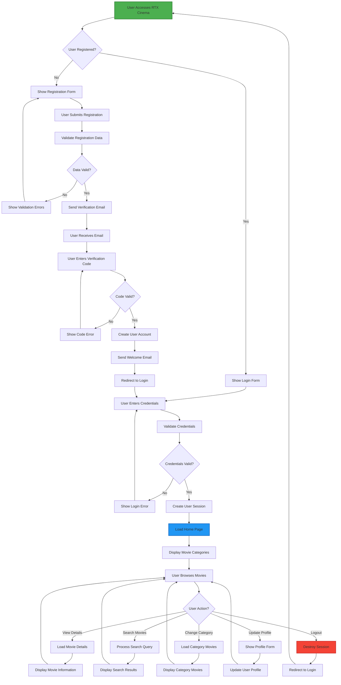
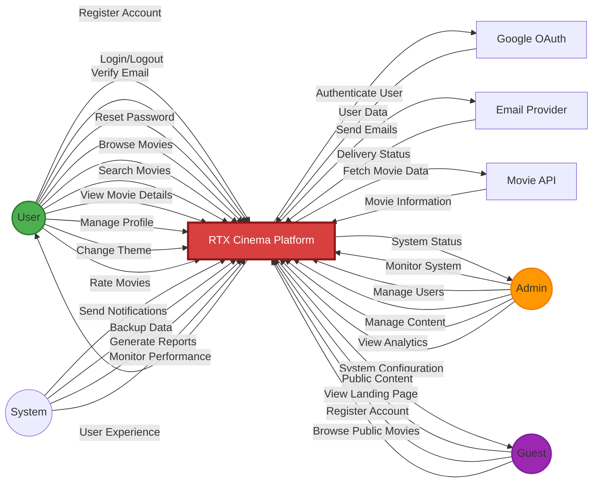
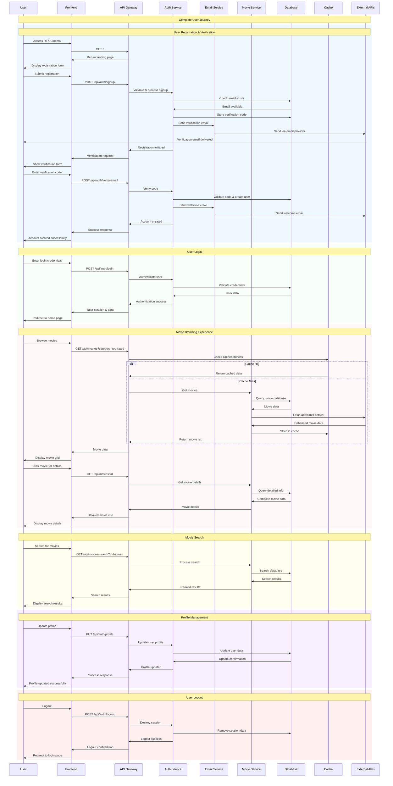

# RTX Cinema - Whole System Diagrams

## 1. Functional Decomposition Diagram (FDD) - Whole System

```mermaid
graph TD
    A[RTX Cinema System] --> B[User Authentication & Authorization System]
    A --> C[Email Communication & Notification System]
    A --> D[Movie Catalog & Content Management System]
    A --> E[User Interface & Experience System]
    A --> F[Backend Services & Data Management System]
    
    B --> B1[User Registration]
    B --> B2[Login/Logout]
    B --> B3[Password Reset]
    B --> B4[Google OAuth]
    B --> B5[Email Verification]
    B --> B6[Profile Management]
    
    C --> C1[Verification Emails]
    C --> C2[Welcome Emails]
    C --> C3[Reset Code Emails]
    C --> C4[Email Templates]
    C --> C5[Email Delivery]
    C --> C6[Email Logging]
    
    D --> D1[Movie Browsing]
    D --> D2[Category Filtering]
    D --> D3[Movie Details]
    D --> D4[Search Function]
    D --> D5[Movie Ratings]
    D --> D6[Content Management]
    
    E --> E1[Responsive Design]
    E --> E2[Navigation System]
    E --> E3[Dark Theme]
    E --> E4[Interactive Components]
    E --> E5[State Management]
    E --> E6[User Preferences]
    
    F --> F1[REST API]
    F --> F2[Database Operations]
    F --> F3[Error Handling]
    F --> F4[Middleware Services]
    F --> F5[Security Management]
    F --> F6[Performance Monitoring]
    
    style A fill:#D84040,stroke:#8E1616,stroke-width:3px,color:#fff
    style B fill:#e8f4f8,stroke:#2196F3,stroke-width:2px
    style C fill:#e8f4f8,stroke:#2196F3,stroke-width:2px
    style D fill:#e8f4f8,stroke:#2196F3,stroke-width:2px
    style E fill:#e8f4f8,stroke:#2196F3,stroke-width:2px
    style F fill:#e8f4f8,stroke:#2196F3,stroke-width:2px
```



## 2. Activity Diagram - Whole System



## 3. Use Case Diagram - Whole System



## 4. Sequence Diagram - Whole System



## 5. Class Diagram - Whole System

```mermaid
classDiagram
    %% Core System Classes
    class RTXCinemaSystem {
        +String version
        +Object config
        +Array subsystems
        +initialize()
        +shutdown()
        +getStatus()
        +handleRequest()
    }
    
    %% User Authentication System
    class User {
        +String id
        +String login
        +String email
        +String password
        +String name
        +String googleId
        +String authMethod
        +Date createdAt
        +Date updatedAt
        +register()
        +login()
        +logout()
        +resetPassword()
        +updateProfile()
        +verifyEmail()
    }
    
    class AuthController {
        +signup()
        +verifyEmail()
        +login()
        +logout()
        +resetPassword()
        +googleAuth()
        +updateProfile()
        +validateSession()
    }
    
    class EmailVerification {
        +String id
        +String email
        +String code
        +Object userData
        +String verificationType
        +Date createdAt
        +Date expiresAt
        +generateCode()
        +validateCode()
        +isExpired()
    }
    
    %% Email System
    class EmailService {
        +String primaryProvider
        +String fallbackProvider
        +Object config
        +sendVerificationEmail()
        +sendWelcomeEmail()
        +sendResetEmail()
        +generateCode()
        +validateProvider()
    }
    
    class EmailTemplate {
        +String id
        +String type
        +String subject
        +String htmlContent
        +String textContent
        +render()
        +personalize()
        +validate()
    }
    
    %% Movie System
    class Movie {
        +String id
        +String title
        +Number rating
        +String genre
        +String year
        +String image
        +String synopsis
        +Array cast
        +String category
        +Date releaseDate
        +getDetails()
        +updateRating()
        +addReview()
    }
    
    class MovieController {
        +getMovies()
        +getMovieById()
        +searchMovies()
        +getCategories()
        +addMovie()
        +updateMovie()
        +deleteMovie()
    }
    
    class Category {
        +String id
        +String name
        +String description
        +Array movies
        +addMovie()
        +removeMovie()
        +getMovies()
    }
    
    %% UI System
    class UIComponent {
        +String id
        +Object props
        +Object state
        +String theme
        +render()
        +handleEvents()
        +updateState()
    }
    
    class ThemeManager {
        +Object darkTheme
        +Object lightTheme
        +String currentTheme
        +applyTheme()
        +toggleTheme()
        +getColors()
    }
    
    class NavigationManager {
        +Array routes
        +String currentRoute
        +Object history
        +navigate()
        +goBack()
        +updateRoute()
    }
    
    %% Backend System
    class APIServer {
        +Number port
        +Object config
        +Array routes
        +Array middleware
        +start()
        +stop()
        +addRoute()
        +handleRequest()
    }
    
    class DatabaseManager {
        +String connectionString
        +Object connection
        +connect()
        +disconnect()
        +query()
        +transaction()
    }
    
    class CacheManager {
        +String cacheType
        +Object config
        +Number defaultTTL
        +get()
        +set()
        +delete()
        +clear()
    }
    
    %% Relationships
    RTXCinemaSystem ||--o{ User : manages
    RTXCinemaSystem ||--o{ Movie : contains
    RTXCinemaSystem ||--o{ EmailService : uses
    RTXCinemaSystem ||--o{ APIServer : runs
    
    User ||--o{ EmailVerification : verifies
    AuthController --> User : manages
    AuthController --> EmailVerification : creates
    
    EmailService ||--o{ EmailTemplate : uses
    
    Movie ||--o{ Category : belongs_to
    MovieController --> Movie : manages
    MovieController --> Category : manages
    
    UIComponent ||--o{ ThemeManager : uses
    UIComponent ||--o{ NavigationManager : uses
    
    APIServer ||--o{ DatabaseManager : uses
    APIServer ||--o{ CacheManager : uses
    APIServer --> AuthController : routes_to
    APIServer --> MovieController : routes_to
```

## 6. Entity Relationship Diagram (ERD) - Whole System

```mermaid
erDiagram
    %% User Management Entities
    USER {
        ObjectId _id PK
        String login UK "Unique username"
        String email UK "User email address"
        String password "Hashed password"
        String name "Full name"
        String googleId "Google OAuth ID"
        String authMethod "email or google"
        Date createdAt "Account creation date"
        Date updatedAt "Last update date"
    }
    
    EMAIL_VERIFICATION {
        ObjectId _id PK
        String email FK "Email to verify"
        String code "6-digit verification code"
        Object userData "Temporary user data"
        String verificationType "signup or google-signup"
        Date createdAt "Verification request date"
        Date expiresAt "Code expiration date"
    }
    
    PASSWORD_RESET {
        ObjectId _id PK
        String email FK "Email for reset"
        String code "6-digit reset code"
        Date createdAt "Reset request date"
        Date expiresAt "Code expiration date"
    }
    
    USER_SESSION {
        ObjectId _id PK
        ObjectId userId FK "Reference to user"
        String token "Session token"
        String ipAddress "User IP address"
        String userAgent "Browser info"
        Date createdAt "Session start"
        Date expiresAt "Session expiration"
        Boolean active "Session status"
    }
    
    %% Movie Management Entities
    MOVIE {
        ObjectId _id PK
        String title "Movie title"
        Number rating "Movie rating 0-10"
        String genre "Movie genres"
        String year "Release year"
        String image "Poster image URL"
        String synopsis "Movie description"
        Array cast "Cast members"
        String category "Movie category"
        Date releaseDate "Official release date"
        String director "Movie director"
        Number duration "Duration in minutes"
        Boolean active "Movie status"
        Date createdAt "Added to system"
        Date updatedAt "Last update"
    }
    
    CATEGORY {
        ObjectId _id PK
        String name UK "Category name"
        String description "Category description"
        String slug "URL-friendly name"
        Number sortOrder "Display order"
        Boolean active "Category status"
        Date createdAt "Category creation"
        Date updatedAt "Last update"
    }
    
    MOVIE_REVIEW {
        ObjectId _id PK
        ObjectId movieId FK "Reference to movie"
        ObjectId userId FK "Reference to user"
        Number rating "User rating 1-10"
        String comment "Review comment"
        Boolean approved "Moderation status"
        Date createdAt "Review date"
        Date updatedAt "Last update"
    }
    
    %% Email System Entities
    EMAIL_LOG {
        ObjectId _id PK
        String recipient "Email recipient"
        String type "Email type"
        String subject "Email subject"
        String provider "Email provider used"
        String status "sent, failed, pending"
        String errorMessage "Error details if failed"
        Date sentAt "Email sent timestamp"
        Date deliveredAt "Delivery confirmation"
    }
    
    EMAIL_TEMPLATE {
        ObjectId _id PK
        String name UK "Template name"
        String type "Template type"
        String subject "Email subject"
        String htmlContent "HTML email content"
        String textContent "Plain text content"
        Object variables "Template variables"
        Boolean active "Template status"
        Date createdAt "Template creation"
        Date updatedAt "Last update"
    }
    
    %% System Management Entities
    SYSTEM_LOG {
        ObjectId _id PK
        String level "log level"
        String message "Log message"
        String module "System module"
        Object metadata "Additional data"
        String ipAddress "Request IP"
        ObjectId userId FK "User if applicable"
        Date timestamp "Log timestamp"
    }
    
    SYSTEM_CONFIG {
        ObjectId _id PK
        String key UK "Configuration key"
        String value "Configuration value"
        String type "Value type"
        String description "Config description"
        Boolean encrypted "Is value encrypted"
        Date createdAt "Config creation"
        Date updatedAt "Last update"
    }
    
    %% Relationships
    USER ||--o{ EMAIL_VERIFICATION : "verifies email"
    USER ||--o{ PASSWORD_RESET : "requests reset"
    USER ||--o{ USER_SESSION : "has sessions"
    USER ||--o{ MOVIE_REVIEW : "writes reviews"
    USER ||--o{ SYSTEM_LOG : "generates logs"
    
    MOVIE ||--o{ MOVIE_REVIEW : "has reviews"
    MOVIE }o--|| CATEGORY : "belongs to category"
    
    CATEGORY ||--o{ MOVIE : "contains movies"
    
    EMAIL_TEMPLATE ||--o{ EMAIL_LOG : "used for emails"
    
    %% Indexes and Constraints
    USER {
        index email_idx "email"
        index login_idx "login"
        index auth_method_idx "authMethod"
        index created_at_idx "createdAt"
    }
    
    MOVIE {
        index title_idx "title"
        index category_idx "category"
        index rating_idx "rating"
        index release_date_idx "releaseDate"
        index active_idx "active"
    }
    
    EMAIL_VERIFICATION {
        index email_code_idx "email, code"
        index expires_at_idx "expiresAt"
    }
    
    USER_SESSION {
        index user_id_idx "userId"
        index token_idx "token"
        index expires_at_idx "expiresAt"
        index active_idx "active"
    }
```



---

## Summary

This document contains all 6 whole system diagrams for RTX Cinema:

1. **Functional Decomposition Diagram (FDD)** - Complete system breakdown into 5 subsystems with all components
2. **Activity Diagram** - Complete user journey from registration to movie browsing
3. **Use Case Diagram** - All actors and their interactions with the entire system
4. **Sequence Diagram** - Complete system flow showing all major interactions
5. **Class Diagram** - All major classes and their relationships across the entire system
6. **Entity Relationship Diagram (ERD)** - Complete database schema with all entities and relationships

Each diagram provides a comprehensive view of the RTX Cinema system at the highest level, showing how all subsystems work together to provide the complete user experience.