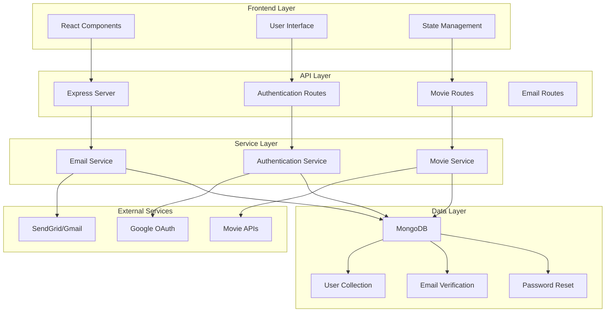
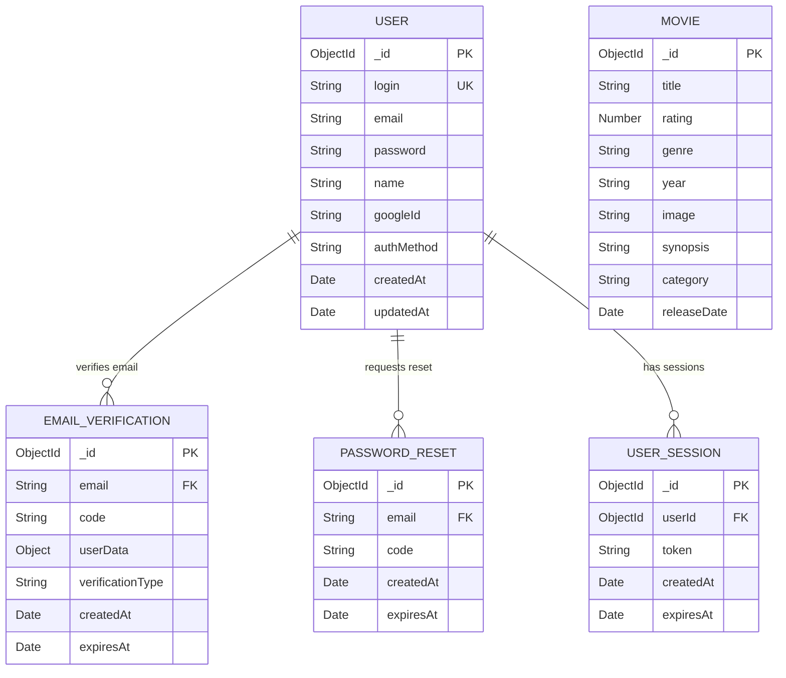
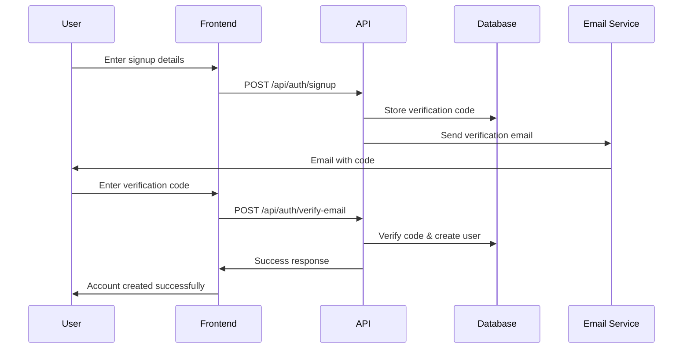
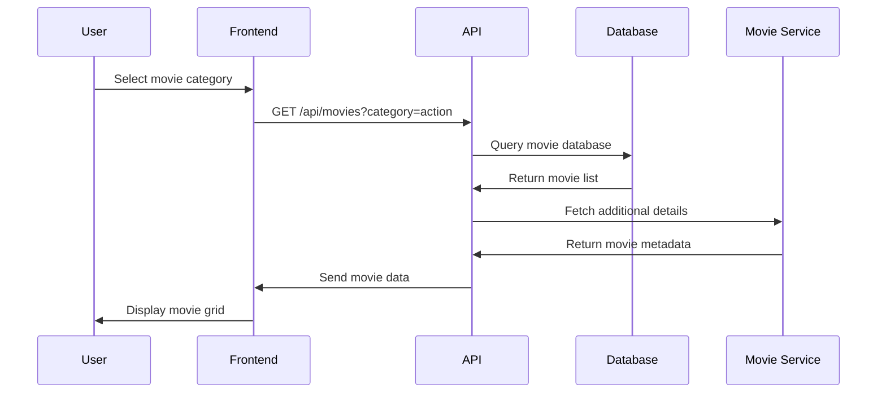

# RTX Cinema System Architecture Diagrams

## 1. Functional Decomposition Diagram (FDD)

```mermaid
graph TD
    A[RTX Cinema System] --> B[User Authentication & Authorization]
    A --> C[Email Communication & Notification]
    A --> D[Movie Catalog & Content Management]
    A --> E[User Interface & Experience]
    A --> F[Backend Services & Data Management]
    
    B --> B1[Registration]
    B --> B2[Login/Logout]
    B --> B3[Password Reset]
    B --> B4[Google OAuth]
    
    C --> C1[Email Verification]
    C --> C2[Welcome Emails]
    C --> C3[Reset Codes]
    C --> C4[Email Templates]
    
    D --> D1[Movie Browsing]
    D --> D2[Category Filtering]
    D --> D3[Movie Details]
    D --> D4[Search Function]
    
    E --> E1[Responsive Design]
    E --> E2[Navigation]
    E --> E3[Dark Theme]
    E --> E4[Interactive Components]
    
    F --> F1[REST API]
    F --> F2[Database Operations]
    F --> F3[Error Handling]
    F --> F4[Middleware]
```

## 2. System Overview Diagram

## 3. Entity Relationship Diagram

## 4. User Authentication Flow

## 5. Movie Browsing Flow

